# Linking Clothes

There are two steps to link clothes to an avatar using VRCFury:
1. Linking the armature, and
1. Linking the blendshapes (optional)

## A. Linking the Armature

Linking the clothing armature "attaches" the clothes to your avatar's bones. Beware that this can only work if the clothes are specifically designed for your avatar. The clothes should have their own armature with bone names matching the ones on your avatar.

1. Drag the clothing prefab onto your avatar's main object. Usually this prefab is part of the package provided from your clothing artist. The filename will vary, but usually it will be a .prefab or sometimes a .fbx file in the main folder provided for the clothing.

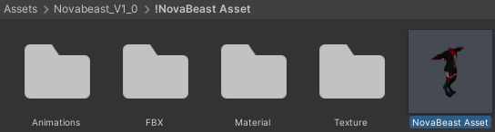

>>

2. Click on the prefab you dragged in, and find the inspector on the right side.

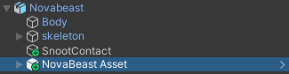

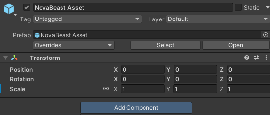

3. Click "Add Component", and add a `VRCFury | Armature Link` component.

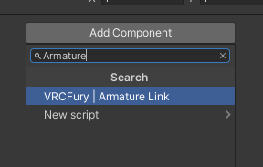

4. Find the root bone of your clothing's armature (in most cases this is Hips), and drag it into the armature link `Link From (Prop / Clothing)` box. (Note, if the main clothing bone isn't the hips, you may need to adjust the `Link To` dropdown to match!)

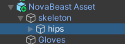

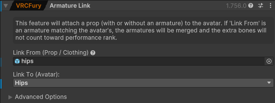

5. You're done! The clothes should now be be properly attached to your avatar when you upload or go into play mode. In rare circumstances, some clothing may require changes in the Advanced Settings section of Armature Link. Join the VRCFury discord if you have questions.

:::warning
If the clothes were designed for your avatar but created using an improper base rig, they may appear to **shrink, expand, or flip upside down**.
This can happen if the clothes were incorrectly exported with bone rotations that didn't match the avatar's bones.
If the clothes look proper in the editor when not in play mode, you can usually fix this by going into the Armature Link **Advanced Options** section, and unchecking `Align Rotation`.
This should be avoided when designing new clothes, since it prevents clothes from applying to avatars that are posed in the editor.
:::

## B. Linking the Blendshapes (optional)

If the clothing has Blendshapes with the same names as the ones on the avatar's body, you can link them automatically.

1. Add a `VRCFury | Blendshape Link` component below the Armature Link component you made earlier.

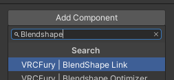

2. In the `Name of skinned mesh object on avatar` box, type the name of the main body renderer on the avatar. This is often called `Body` or similar.

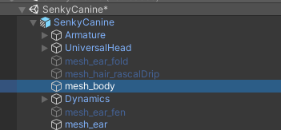

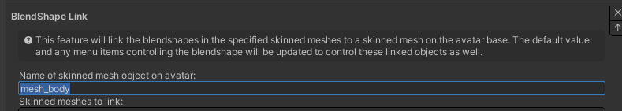

3. Click the plus on `Skinned meshes to link`, and drag in the renderer/mesh object from your clothes. Usually this is the child object inside the clothing prefab that IS NOT the armature. If the clothing prefab contains multiple renderers, you can add them all.

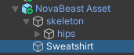

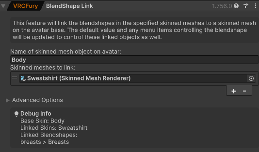

:::info
If your clothes have blendshape names that differ from the base, eg. spelled differently or prefixed, open the **Advanced Options** section and enter the blendshape name on the base and linked mesh.

:::

4. The debug info box will show the blendshapes which are linked. If you linked additional blendshapes, verify that they appear here.

:::warning
Blendshapes driven by VRChat directly like Visemes or Blinking are special and cannot be linked by Blendshape Link as they are not driven through animations.\
If you need to link these Blendshapes, either merge the meshes using an app like blender, or use an [Advanced Visemes](/components/other#advanced-visemes) or [Blink Controller](/components/other#blink-controller) component.
:::