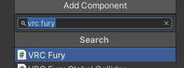
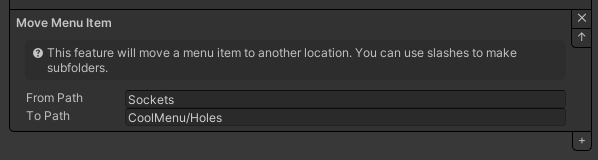

# SPS (Super Plug Shader)

SPS, or Super Plug Shader, is a free deformation shader for VRChat that can used to deform meshes towards a target. This is a
full backward-compatible replacement for DPS (Dynamic Penetration System by Raliv), and TPS (Thry Penetration System in Poiyomi Pro).

## Benefits

* Free (!?!?!?!)
* Works fully with both rigged AND un-rigged meshes
* The transition between undeformed and deformed states is smooth and doesn't "snap"
* The deformation curve doesn't cause stretching issues like other alternatives
* Works properly with Avatar Scaling, and scaling of mesh
* Backward compatible with all TPS and DPS systems
* Very easy setup
* Compatible with nearly ANY shader! Poiyomi Toon or Pro 7/8+, liltoon, UTS, Mochie, XSToon, Silent, Standard, and MORE!

## How to Set-up a Plug

* [Ensure VRCFury is up to date](/download) (we're always adding features and fixing bugs!)
* Tools > VRCFury > Haptics > Create Plug
* If your mesh is rigged (it has bones):
  * Drag the new object onto the bone nearest the "base" or "bottom" of the area that should deform
* If your mesh is un-rigged (no bones):
  * Drag the new object onto the mesh renderer for the mesh that should deform
* Position the new object so that it's located at the "base" or "bottom" of the area that should deform
* Rotate the new object so that the "Tip" of the red capsule in the 3D view is at the "tip" of the deformed area

> **Upgrading from DPS?** Find the `Tip` object in the hierarchy, and remove the Light component, then change the shader on the material from `Raliv/Penetrator` to `Standard`

> **Upgrading from TPS?** Disable the `Penetrator` checkbox on the Poiyomi material

## How to Set-up a Socket

* [Ensure VRCFury is up to date](/download) (we're always adding features and fixing bugs!)
* Tools > VRCFury > Haptics > Create Socket
* Drag the new object onto the bone you'd like to attach it to
* Position the new object so it's located where you'd like plugs to target
* Rotate the new object so the arrow points INWARD

> **Already got DPS or TPS orifices?** 
> You can keep them as is (SPS is backward-compatible), or you can upgrade them automatically with 
> **Tools > VRCFury > Haptics > Upgrade Legacy Haptics!**

## How to Test in the editor

* Ensure you have [Gesture Manager](https://github.com/BlackStartx/VRC-Gesture-Manager) installed (Available in the VCC "Manage Your Project")
* If you are testing a plug, add a test Socket to your scene (see above). It does not need to be inside your avatar.
* If you are testing socket animations, be sure the plug has contacts. Non-upgraded DPS does not contain contacts. You can upgrade
  plain DPS plugs by selecting them, then clicking Tools > VRCFury > Haptics > Upgrade Legacy Haptics.
* Ensure the light bulb button on the top left of unity's 3d view is ON
* Go into play mode
* Select the Gesture Manager object (if you don't have one, Tools > Gesture Manager Emulator)
* If you are testing a socket on the avatar, be sure to turn it on in the "Sockets" menu in Gesture Manager
* Move things around and have fun!

## How to move/rename generated "Sockets" menu

* Select your avatar root object in the hierarchy, the same object that contains your VRC Avatar Descriptor.
* In the Inspector, if there is not already a VRC Fury component, click "Add Component" and add one.
  > 
* In that VRC Fury component, click the "+" on the bottom right and add a "Move Menu Item" subcomponent.
* In `From Path`, enter `Sockets`
* In `To Path`, enter the new path you want to find it in. For example, if you want it called `Holes` in a folder called `CoolMenu`, you would type in `CoolMenu/Holes`
  > 
* Done!
## Troubleshooting

### Plug continues deforming in editor even when all sockets are disabled

A bug in the unity editor causes shaders to receive old light positions when all lights have been disabled. This
does not occur in game.

### Plug seems to work in the editor, but doesn't deform in game

Ensure you have `Avatar Self Interact` enabled in the VRChat settings menu.

import selfInteract from './assets/sps/self-interact.png';

### Other question?

Ask on the discord!
