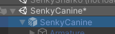
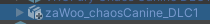
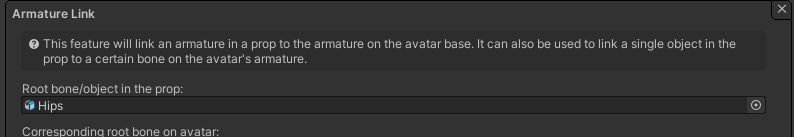
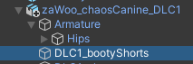

# Linking Clothes

There are two steps to link clothes to an avatar using VRCFury:
1. Link the armature, and
1. Link the blendshapes (optional)

## A. Linking the Armature

Linking the clothing armature "attaches" the clothes to your avatar's bones. Beware that this can only work if the clothes are specifically designed for your avatar. The clothes should have their own armature with bone names matching the ones on your avatar.

1. Drag the clothing prefab onto your avatar's root object. Usually this is part of the package provided from your clothing artist. The filename will vary, but usually it will be a .prefab or sometimes a .fbx file in the main folder provided for the clothing.

>>

2. Click on the prefab you dragged in, and find the inspector on the right side.

3. Click "Add Component", and add a VRC Fury component with an Armature Link feature.

4. Find the Hips bone in your clothing's armature (the location and name of the hips bone varies from clothing to clothing), and drag it into the armature link `Root bone/object in the prop` box. (Note, if the main clothing bone isn't the hips, you may need to adjust the dropdown to match!)

5. You're done! The clothes should now be be properly attached to your avatar when you upload or go into play mode. In rare circumstances, some clothing may require changes in the Advanced Settings section of Armature Link. Join the VRCFury discord if you have questions.

## B. Linking the blendshapes (optional)

If the clothing has blendshapes with the same names as the ones on the avatar's body, you can link them automatically.

1. Add a `Blendshape Link` to the VRC Fury component you made earlier.

2. In the `Name of skinned mesh object on avatar` box, type the name of the main body renderer on the avatar. This is often called `Body` or similar.

3. Click the plus on `Skinned meshes to link`, and drag in the renderer object from your clothes. Usually this is the child object inside the clothing prefab that IS NOT the armature. If the clothing prefab contains multiple renderers, you can add them all.

4. The debug info box will show the blendshapes which are linked.
